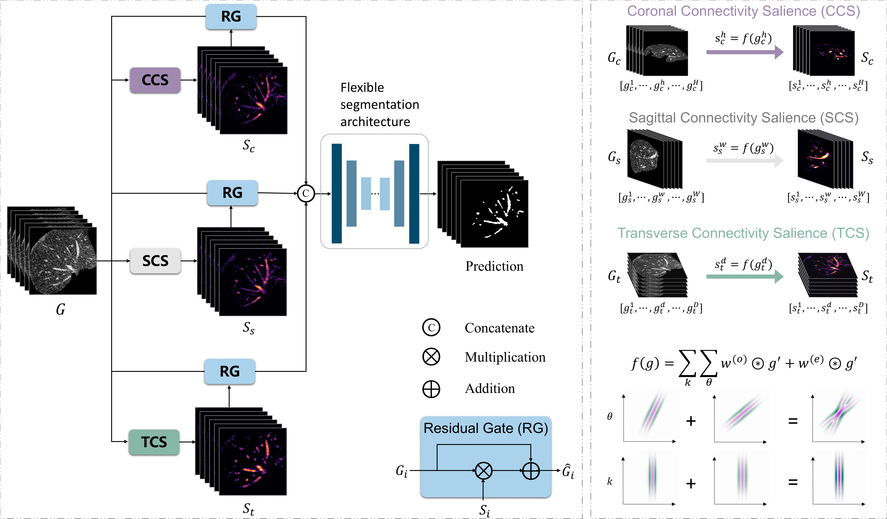

# Connectivity-aware salience demystifies inconspicuous liver vessel segmentation

- Implementation of our work: [Connectivity-aware salience demystifies inconspicuous liver vessel segmentation](https://arxiv.org/abs/xxxx.xxxxx).



## 1.  Prepare data

      1. Sign up in the [official 3D-IRCADb website](https://www.ircad.fr/research/data-sets/liver-segmentation-3d-ircadb-01/) and download the dataset. Convert them to numpy format, clip the images within [0, 400], normalize each 3D image to [0, 1], and extract 2D slices from 3D volume for training cases while keeping the 3D volume in h5 format for testing cases.
      2. Generating the connectivity-aware salience of each 3D volume. The relevant code for generating saliency maps can be found in "./salience_generation.py".
      3. You can also send an Email directly to xiaoxu_u@qq.com to request the preprocessed data for reproduction.
   4. The directory structure of the whole project is as follows:

```bash
.
├── data
|   └──3D-IRCADb
|       ├── slice_data
|       │   ├── case0001_slice0000.h5
|       │   └── *.h5
|       ├── vol_data
|       |   ├── case0001.h5
|       |   └── *.h5
|       └── vol_salience
|           ├── case0001.h5
|           └── *.h5
├── dataloaders
│   ├──dataset.py
│   └──...
├── imgs
│   └──Figure2.png
├── list
│   └──3D-IRCADb
|       ├── slice_train.txt
|       ├── vol_test.txt
|       └── vol_val.txt
├── networks
│   └── unet.py
│   └──...
├── main.py
├── requirements.txt
├── salience_generation.py
├── test.py
└── trainer.py
```

## 2. Environment

Please prepare an environment with python=3.7, and then use the command "pip install -r requirements.txt" for the dependencies.

## 3. Train/Test

* Run the train script on 3D-IRCADb dataset. The backbone could be any segmentation architecture.

  ```bash
  CUDA_VISIBLE_DEVICES=0 python main.py --dataset 3D-IRCADb --backbone unet
  ```

* Run the test script on 3D-IRCADb dataset. 

  ```bash
  python test.py --dataset 3D-IRCADb --backbone unet
  ```

## Citations

```tex
@article{xiao2023connectivity-aware,
  title={Connectivity-aware salience demystifies inconspicuous liver vessel segmentation},
  author={Xiao et al.},
  journal={arXiv preprint arXiv:xxxx.xxxxx},
  year={2023}
}
```

